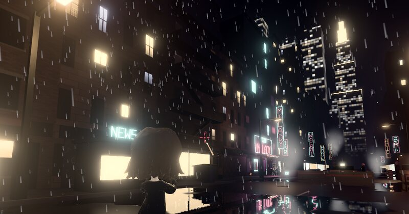

i make browser games and 3d radbros. all of it is free to play, fork and use.

[vyvanse.beer](https://vyvanse.beer) · [x.com/dexedrne](https://x.com/dexedrne)

### games

<table>
<tr>
<td width="33%" valign="top">

 <b>RadRun</b> 
radbro rooftop chase. he swiped your bag, you get 90 seconds to swing across the rooftops and take it back. 
<a href="https://radrun.vyvanse.beer">play</a> · <a href="https://github.com/dexedrne/radrun">source</a>
</td>
<td width="33%" valign="top">

 <b>RadPayne</b> 
bullet-time noir shooter with the radbros. chapter 1 is still being built. 
<a href="https://radpayne.vyvanse.beer">play (early)</a> · <a href="https://github.com/dexedrne/radpayne">source</a>
</td>
<td width="33%" valign="top">

 <b>Solscape</b> 
my open-source, copyright-free rev254 private server, on solana. train skills, do quests, explore with other players. 
<a href="https://play.solscape.fun">play</a> · <a href="https://www.solscape.fun">site</a>
</td>
</tr>
</table>

radrun and radpayne run on [react-three-game](https://prnth.com/react-three-game/) by prnth.

### 3d radbros, free to use

<table>
<tr>
<td align="center"> #652</td>
<td align="center"> #4764</td>
<td align="center"> #2564</td>
<td align="center"> #723</td>
</tr>
</table>

four radbros, rigged and animated. put them in your game, render them, remix them, sell them. for radbros, miladies, anyone.
get them from [radbros-3d](https://github.com/dexedrne/radbros-3d) or one click each at [vyvanse.beer](https://vyvanse.beer/#crew).

### sites i built

for other people's projects.

<table>
<tr>
<td align="center" valign="top"> bitcorn</td>
<td align="center" valign="top"> bulk</td>
<td align="center" valign="top"> bulkagachi</td>
<td align="center" valign="top"> sanic</td>
<td align="center" valign="top"> hog rider 3d</td>
</tr>
</table>

### use my stuff

the 3d radbros, radrun and radpayne are under the [viral public license](https://viralpubliclicense.org/VPL.txt), same as milady and remilio: use them for anything, no credit needed, just keep the license attached. the vyvanse.beer site code is MIT.

### contact

dm me on x: [@dexedrne](https://x.com/dexedrne)
